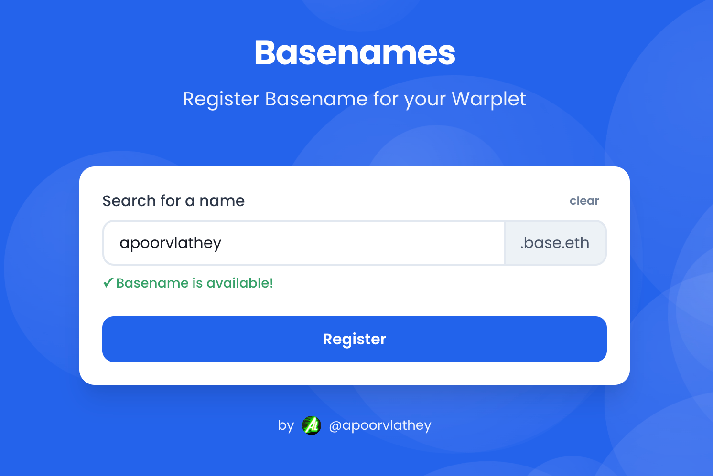

# Basenames for Warplet Mini-App

<div align="center">
  
**🔗 [basenames.apoorv.xyz](https://basenames.apoorv.xyz)**



</div>

A mobile-first mini-app for registering and setting basenames for Farcaster wallets on Base network.

## Features

- Register basenames on Base Mainnet and Base Sepolia
- Mobile-first, responsive design
- Real-time basename availability checking
- Mini-app support for Farcaster

## Getting Started

1. Install dependencies:

```bash
pnpm install
```

2. Start the development server:

```bash
pnpm dev
```

3. Open [http://localhost:3000](http://localhost:3000) with your browser to see the result.

## Usage

1. Connect your wallet (Base Mainnet or Base Sepolia)
2. Enter your desired basename
3. The app will automatically check if the basename is available
4. Click "Register Basename" to register your basename
5. Confirm the transaction in your wallet
6. Enjoy the confetti celebration upon successful registration!

## Networks Supported

- Base Mainnet (Chain ID: 8453)
  - Basenames end with `.base.eth`
- Base Sepolia (Chain ID: 84532)
  - Basenames end with `.basetest.eth`

## Project Structure

```
src/
├── app/              # Next.js app router pages
├── components/       # Reusable UI components
├── config/          # Configuration files
├── lib/             # Utility functions and helpers
└── providers/       # React context providers
```

## Available Scripts

- `pnpm dev` - Start development server
- `pnpm build` - Build production bundle
- `pnpm start` - Start production server
- `pnpm lint` - Run ESLint

## License

MIT
